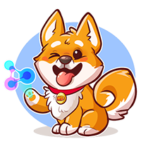

# Nano Dogecoin

**Nano Dogecoin** is a token with community and charity involvement at the forefront of what we do. We intend to keep investors included in the decision-making process throughout the life of the token and will take further suggestions for future growth, charity partnerships, brand ambassadorships and more from our holders.

We at **Nano Dogecoin** aim to use our reach to change animal welfare around the globe and to have fun while doing so. We've developed this token to truly allows our investors to shape its future.

## Token Deployment

| Data                 | Value                                        |
|----------------------|----------------------------------------------|
| **Chain**            | Binance Smart Chain                          |
| **Contract address** | [`0x1B41821625d8CFAd21cd56491DACD57ECaCc83dE`](https://bscscan.com/address/0x1B41821625d8CFAd21cd56491DACD57ECaCc83dE#code) |

## Deployment

The deployed contracts are built into the `build` directory.

## Source

The original source code resides in the `src` directory.

